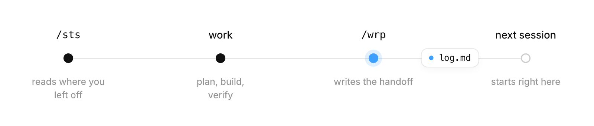

<picture>
  <source media="(prefers-color-scheme: dark)" srcset=".github/assets/logo-dark.svg">
  
</picture>

<br>

[](LICENSE) [](https://code.claude.com/docs)

**merlin** is a Claude Code workspace that remembers. You keep all your projects in one folder, and each one keeps its own notes, so a new session picks up exactly where the last one stopped. Three short commands handle the routine, and every mistake Claude makes becomes a rule so it doesn't happen twice.

It works for any kind of project, code or not.

<picture>
  <source media="(prefers-color-scheme: dark)" srcset=".github/assets/loop-dark.png">
  
</picture>

## Why it works

- **Simple.** Three commands and a few plain Markdown files. There's no database, no plugin and nothing extra to install.
- **You're in control.** Everything Claude knows about your projects lives in files you can read, edit and version with git. Nothing is hidden, and you can fix any note by hand.
- **Small, focused context.** A session loads the workspace rules, the project you're working on, and the latest handoff. It doesn't load your whole history. Claude Code only reads a project's `CLAUDE.md` when it works in that folder, so other projects stay out of the way.
- **Short by design.** Rules are one line each, a handoff is a few bullets, and each `CLAUDE.md` stays under 200 lines. The [Claude Code docs](https://code.claude.com/docs/en/memory) note that longer instruction files use more context and are followed less reliably.

## Quick start

```bash
gh repo create my-workspace --template seymurglv/merlin --private --clone
cd my-workspace
```

No GitHub CLI? Clone it and start a fresh history instead:

```bash
git clone https://github.com/seymurglv/merlin.git my-workspace
cd my-workspace && rm -rf .git && git init
```

Open Claude Code in the folder and create your first project:

```
/new-project my-first-project what this project is for
```

## Commands

| Command | When | What it does |
|---|---|---|
| `/sts` | Start | Shows each project's phase, the last session, and the next step |
| `/wrp` | End | Writes the handoff to `log.md`, updates status, logs mistakes, commits locally |
| `/new-project` | New idea | Creates a project folder from the template and adds it to `PROJECTS.md` |

The names are short on purpose, and they don't clash with Claude Code's built-in commands. There's already a built-in `/status`.

## What a handoff looks like

When you run `/wrp`, it adds an entry like this to the top of the project's `log.md`:

```md
## 2026-10-02: landing page draft

**Done**
- Built the hero section in `site/index.html`

**Decisions (user agreed)**
- Keep the page single-column

**Open**
- Which font for headings?

**Next steps**
1. Add the pricing section
```

Next time, `/sts` reads that entry back:

| Project | Phase | Last session | Next step |
|---|---|---|---|
| landing-page | Building | 2026-10-02: hero done | Add pricing section |

*Illustrative example. Your entries will reflect your own work.*

## Habits built in

- **Plan first, then go.** For anything bigger than a quick fix, you agree on a plan first, then Claude runs without stopping.
- **Mistakes become rules.** When Claude gets something wrong, it adds a row to the mistake log in `CLAUDE.md`, and every future session reads it.
- **Every session ends with a handoff.** `/wrp` writes down what was done, what was decided, and what's next. `/sts` reads it back.
- **Verify before "done".** Every command ends with a check, and Claude says what it verified.
- **Helpers on the same model.** The subagents use `model: inherit` at medium, high, and xhigh effort, so no task quietly lands on a weaker model.
- **Safe permissions, not zero permissions.** Routine actions run without asking, and risky ones always ask.

## What's inside

```
.
├── CLAUDE.md            workspace rules + the mistake log
├── PROJECTS.md          one row per project
├── .claude/
│   ├── settings.json    pre-approved safe actions; asks before risky ones
│   ├── skills/          sts, wrp, new-project
│   └── agents/          worker, analyst, deep-researcher
└── _templates/project/  every new project starts with:
    ├── CLAUDE.md        project rules and context
    ├── README.md        what it is + status checklist
    └── log.md           session log, newest first
```

## Details

- **Two layers of rules.** The root `CLAUDE.md` holds the workspace rules, and each project's `CLAUDE.md` holds its own. Open Claude Code inside a project folder and it loads both.
- **Permissions** (`.claude/settings.json`):
  - These run without asking: edits inside the workspace, and git `status`, `diff`, `log`, `show`, `add` and `commit`.
  - These always ask, even in auto mode: deleting files, and git `push`, `reset`, `clean`, `checkout` and `restore`.
- **Same model everywhere.** `settings.json` sets `CLAUDE_CODE_SUBAGENT_MODEL_FORCE=1`, so built-in helpers run on your main model too.
- **One memory.** Claude Code's auto memory is keyed to the git repository. If you keep the workspace a git repo, every session shares one memory, even sessions opened inside a project folder.

## Make it yours

- **Rules:** add your own under the marked line in `CLAUDE.md`, such as language, tone, or things Claude must never do.
- **Commands:** allow more commands in `.claude/settings.json`, for example `"Bash(npm run *)"` or `"Bash(python3 *)"`.
- **Project-only commands:** put them in `<project>/.claude/skills/`.
- **Global gitignore:** if yours ignores `.claude/`, the `!.claude/` line in `.gitignore` keeps it in git.

## Requirements

- [Claude Code](https://code.claude.com/docs) 2.1.257 or later. That's needed for the subagent model setting. On older versions, remove the `env` block from `.claude/settings.json`.
- git
- [GitHub CLI](https://cli.github.com), optional, for the one-line quick start

## License

MIT
